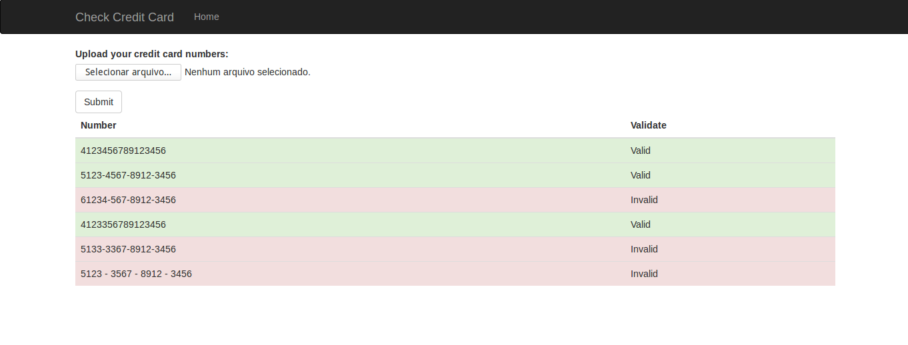

# CreditCardCheck

Project related to solution of the Problem One: Validate Credit Card

## Project Structure

```
.
├── cc_check
│   ├── core.py
│   ├── forms.py
│   ├── __init__.py
│   ├── templates
│   │   ├── base.html
│   │   └── index.html
│   └── views.py
├── manage.py
├── README.md
├── requirements.txt
├── tests
│   ├── conftest.py
│   ├── __init__.py
│   ├── test_core.py
│   └── test_views.py
└── t.txt

3 directories, 14 files
```

## Problem solution code

The logic for validate the credit card number is in `cc_check/core.py` and is described below:

```
import re


def validate_cc_number(number):
    match = re.search(r'^([4-6])(\d{3}\-\d{4}\-\d{4}\-\d{4}|\d{15})$', number)
    if match:
        number = match.groups()[0] + ''.join(match.groups()[1].split('-'))
        if not re.search(r'(\d)\1{3}', number):
            return True
    return False
```

## Running Dev Server

From root project:
    `python manage.py runserver`
    
## Index page example


